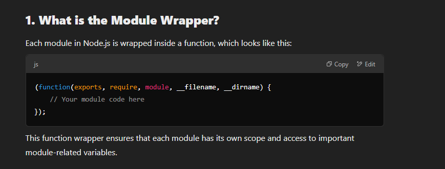
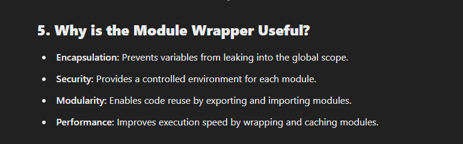

In Node.js, every JavaScript file is treated as a separate module. When you write code in a module, Node.js wraps it inside a function before execution. This wrapper function provides a private scope to the module, preventing variable and function pollution across different modules.

